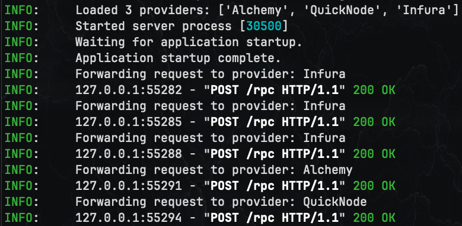

<p align="center">
  
</p>

# Rotating Ethereum JSON-RPC Middleware <a href="https://github.com/jimouris/rpc-middleware/blob/main/LICENSE" target="_blank"></a>

A lightweight middleware that accepts Ethereum JSON-RPC requests and forwards
each to a randomly chosen provider from a pool.

> **Note 1:** This project is for research and not production-ready. Use at your own risk.

> **Note 2:** This is meant to be run inside a trusted execution environment (TEE) so that the TEE handles all the interactions with the RPC providers instead of the dAPP or user wallet.


## Setup
1. **Install dependencies:**
   ```shell
   pip install -r requirements.txt
   ```
2. **Configure providers:** Copy `rpc-providers/example.csv` to
  `rpc-providers/rpcs.csv` and update it with your RPC endpoints and API keys.

3. **Run the server:**
   ```shell
   uvicorn src.main:app --reload
   ```

With the server running, you can:
1. **Send JSON-RPC requests:**
  - POST to `http://localhost:8000/rpc`
2. **View metrics:**
  - GET `http://localhost:8000/metrics`

For example:
```shell
curl -X POST http://localhost:8000/rpc \
  -H "Content-Type: application/json" \
  -d '{"jsonrpc":"2.0","method":"eth_blockNumber","params":[],"id":1}'
```
returns
```shell
{"jsonrpc":"2.0","id":1,"result":"0x15eb54a"}
```

<p align="left">
  
</p>

Go to `http://127.0.0.1:8000/metrics` to see how many times each RPC has been
used!

## Docker Support
You can also build it and run with Docker:
```shell
docker build -t rpc-middleware .
docker run -p 8000:8000 rpc-middleware
```
